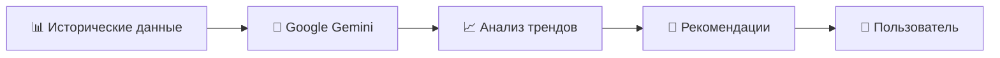

# 🥧 PieStat Bot

<div align="center">


**AI-powered система учета продаж и прогнозирования для малого бизнеса**

[](https://nodejs.org/)
[](https://supabase.com/)
[](https://telegram.org/)
[](https://ai.google.dev/)
[](https://jestjs.io/)

[Возможности](#-возможности) • [Технологии](#️-технологический-стек) • [Архитектура](#️-архитектура) • [AI-Прогнозирование](#-ai-прогнозирование)

</div>

---

## 📖 О проекте

**PieStat Bot** — это интеллектуальный Telegram-бот для автоматизации учета продаж, остатков и финансовой аналитики в малом бизнесе. Проект разработан для владельцев пекарен, кондитерских и других производственных предприятий, где критически важен ежедневный контроль товарооборота.

### 🎯 Решаемые задачи

- 📝 Ежедневный учет производства и продаж без Excel-таблиц
- 💰 Автоматический расчет выручки и чистой прибыли
- 🤖 Умные рекомендации по объемам производства на основе AI
- 📊 Мгновенная аналитика за любой период времени
- ⏰ Автоматические отчеты для всей команды

---

## ✨ Возможности

### 📊 Учет и Управление
- 🥖 **Учет продукции** — быстрое добавление произведенной продукции
- 📦 **Остатки** — контроль непроданной продукции
- 💸 **Расходы** — учет операционных затрат
- 🗑️ **Списания** — фиксация испорченной продукции
- 💲 **Управление ценами** — изменение цен прямо в боте

### 📈 Аналитика и Отчеты
- 📅 **Гибкие отчеты** — день, неделя, месяц или произвольный период
- 💹 **Финансовые метрики** — продажи, выручка, чистая прибыль
- 🏆 **Рейтинги продуктов** — самые прибыльные и продаваемые позиции
- 📊 **Анализ по дням недели** — определение самых продуктивных дней
- ⏰ **Автоматическая рассылка** — ежедневные отчеты в заданное время

### 🤖 AI-Прогнозирование
- 🧠 **Машинное обучение** — анализ исторических данных через Google Gemini
- 📈 **Умные рекомендации** — оптимальный объем производства на завтра
- 🎯 **Минимизация потерь** — сокращение остатков и списаний
- 📉 **Прогноз спроса** — учет трендов и сезонности

### 🔐 Безопасность и Контроль
- 🛡️ **Ограничение доступа** — только авторизованные пользователи (по chat_id)
- 👥 **Многопользовательский режим** — для всей команды
- 🔒 **Безопасное хранение** — данные в защищенной базе Supabase

---

## 🛠️ Технологический стек

<table>
<tr>
<td width="50%">

### Backend & Bot
- **Node.js** — среда выполнения
- **JavaScript (ES6+)** — язык разработки
- **node-telegram-bot-api** — Telegram интеграция
- **Express.js** — health check сервер
- **node-cron** — планировщик задач

</td>
<td width="50%">

### Database & AI
- **Supabase (PostgreSQL)** — база данных
- **Google Gemini AI** — прогнозирование
- **RPC Functions** — серверная бизнес-логика
- **Jest** — автоматизированное тестирование

</td>
</tr>
</table>

---

## 🏗️ Архитектура

Проект построен на **модульной архитектуре** для максимальной гибкости и поддерживаемости:

```
piestat-bot/
├── bot.js                    # 🎮 Контроллер: обработка команд и состояний
├── db.js                     # 💾 Data Access Layer: взаимодействие с Supabase
├── gemini_service.js         # 🤖 AI Module: интеграция с Google Gemini
├── keyboards.js              # 🎨 UI Layer: генерация клавиатур
├── utils.js                  # 🛠️ Utilities: форматирование, валидация
├── config.js                 # ⚙️ Configuration: настройки проекта
├── __tests__/                # 🧪 Automated Tests
│   ├── bot.test.js
│   ├── db.test.js
│   └── utils.test.js
└── .env                      # 🔐 Environment Variables
```

### Принципы архитектуры

- **Разделение ответственности** — каждый модуль решает одну задачу
- **Бизнес-логика на стороне БД** — RPC-функции в Supabase для производительности
- **Тестируемость** — покрытие критических функций тестами
- **Масштабируемость** — легко добавлять новые команды и функции

---

## 🤖 AI-Прогнозирование

### Как это работает



1. **Сбор данных** — бот извлекает продажи за последние 30 дней
2. **AI-анализ** — Google Gemini обрабатывает паттерны и тренды
3. **Генерация рекомендаций** — оптимальный объем производства по каждому продукту
4. **Учет факторов** — день недели, сезонность, история списаний

### Пример прогноза

```
🤖 Рекомендации на завтра (Суббота):

🥖 Хлеб белый: 150 шт. (+10% к среднему)
🍞 Багет: 80 шт. (обычный объем)
🥐 Круассан: 120 шт. (+15% — выходной день)

💡 Суббота обычно показывает повышенный спрос.
Рекомендуем увеличить производство на 10-15%.
```

---

## 🚀 Быстрый старт

### Предварительные требования

- Node.js >= 16.x
- Аккаунт Supabase
- Telegram Bot Token
- Google Gemini API Key

### Установка

```bash
# 1. Клонируйте репозиторий
git clone https://github.com/S7L5An/piestat-bot.git
cd piestat-bot

# 2. Установите зависимости
npm install

# 3. Создайте .env файл
cp .env.example .env
# Заполните переменные окружения

# 4. Запустите бота
npm start
```

### Переменные окружения

```env
# Supabase
SUPABASE_URL=https://your-project.supabase.co
SUPABASE_KEY=your_supabase_anon_key

# Telegram
TELEGRAM_BOT_TOKEN=your_telegram_bot_token
ALLOWED_CHAT_IDS=123456789,987654321

# AI
GEMINI_API_KEY=your_gemini_api_key

# Автоматические отчеты
REPORT_SCHEDULE=0 20 * * *           # Каждый день в 20:00
REPORT_TIMEZONE=Asia/Tashkent
```

---

## 📱 Использование

### Основные команды

| Команда | Описание |
|---------|----------|
| `/start` | Запуск бота и главное меню |
| `/stats` | Быстрая статистика за сегодня |
| `/forecast` | AI-прогноз на завтра |
| `/reports` | Генерация отчетов за период |
| `/settings` | Управление ценами и настройками |

---

## 🧪 Тестирование

```bash
# Запуск всех тестов
npm test

# Запуск с покрытием
npm run test:coverage

# Watch mode для разработки
npm run test:watch
```

### Покрытие тестами

- ✅ Валидация входных данных
- ✅ Форматирование чисел и дат
- ✅ Расчет финансовых метрик
- ✅ Интеграция с базой данных
- ✅ Обработка ошибок

---

## 🔐 Безопасность

- 🛡️ **Белый список пользователей** — доступ только по chat_id
- 🔒 **Безопасное хранение API ключей** — через переменные окружения
- ✅ **Валидация данных** — проверка всех пользовательских вводов
- 🚫 **Защита от SQL-инъекций** — использование параметризованных запросов
- 🔐 **RLS в Supabase** — Row Level Security для данных

---

## 📊 Примеры отчетов

### Дневной отчет

```
📊 Отчет за 04.11.2024

💰 Финансы:
├─ Выручка: 1,250,000 сум
├─ Расходы: 800,000 сум
└─ Прибыль: 450,000 сум (36%)

📦 Продажи: 450 шт.
🗑️ Списания: 15 шт. (3.3%)

🏆 Топ продуктов:
1. 🥖 Хлеб белый — 150 шт.
2. 🍞 Багет — 80 шт.
3. 🥐 Круассан — 120 шт.
```

### Месячная аналитика

```
📈 Анализ за Октябрь 2024

📊 Общая статистика:
├─ Выручка: 37,500,000 сум
├─ Прибыль: 13,500,000 сум
└─ Маржа: 36%

📅 Лучший день: Суббота (ср. 1,500,000 сум)
📉 Худший день: Понедельник (ср. 950,000 сум)

🔥 Самый прибыльный: 🥖 Хлеб белый
⭐ Самый продаваемый: 🍞 Багет
```

---

## 🎯 Roadmap

- [ ] 📱 Web-интерфейс для детальной аналитики
- [ ] 📧 Email-рассылка отчетов
- [ ] 🌍 Мультиязычность (русский/узбекский)
- [ ] 📸 Загрузка фото чеков
- [ ] 💳 Интеграция с платежными системами
- [ ] 📊 Экспорт данных в Excel/PDF

---

## 👨‍💻 Автор

**Sultanbek Otanazarov**

- GitHub:@TheSultann
- Telegram: [@S7L5An](https://t.me/S7L5An)
- Email: otanazarovsultanbek@gmail.com

---

## 🤝 Поддержка проекта

Если проект оказался полезным:

- ⭐ Поставьте звезду на GitHub
- 🐛 Сообщите о багах через https://github.com/TheSultann/PieTrack-A/issues
- 💡 Предложите идеи для улучшения
- 📢 Расскажите о проекте коллегам

---


